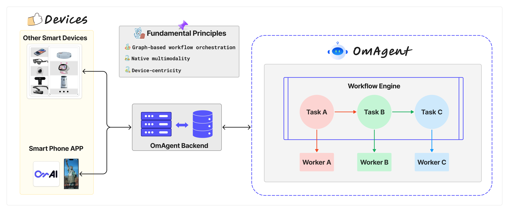

# Introduction
OmAgent is an open-source agent framework designed to streamlines the development of on-device multimodal agents. Our goal is to enable agents that can empower various hardware devices, ranging from smart phone, smart wearables (e.g. glasses), IP cameras to futuristic robots. As a result, OmAgent creates an abstraction over various types of device and simplifies the process of connecting these devices to the state-of-the-art multimodal foundation models and agent algorithms, to allow everyone build the most interesting on-device agents. Moreover, OmAgent focuses on optimize the end-to-end computing pipeline, on in order to provides the most real-time user interaction experience out of the box. 

In conclusion, key features of OmAgent include:

- **Easy Connection to Diverse Devices**: we make it really simple to connect to physical devices, e.g. phone, glasses and more, so that agent/model developers can build the applications that not running on web page, but running on devices. We welcome contribution to support more devices! 

- **Speed-optimized SOTA Mutlimodal Models**: OmAgent integrates the SOTA commercial and open-source foundation models to provide application developers the most powerful intelligence. Moreover, OmAgent streamlines the audio/video processing and computing process to easily enable natural and fluid interaction between the device and the users. 

- **SOTA Multimodal Agent Algorithms**: OmAgent provides an easy workflow orchestration interface for researchers and developers implement the latest agent algorithms, e.g. ReAct, DnC and more. We welcome contributions of any new agent algorithm to enable more complex problem solving abilities.

- **Scalability and Flexibility**: OmAgent provides an intuitive interface for building scalable agents, enabling developers to construct agents tailored to specific roles and highly adaptive to various applications.  

## Architecture
The design architecture of OmAgent adheres to three fundamental principles:  
1. Graph-based workflow orchestration;   
2. Native multimodality;   
3. Device-centricity.   

With OmAgent, one has the opportunity to craft a bespoke intelligent agent program.  

For a deeper comprehension of OmAgent, let us elucidate key terms:  

  

  

- **Devices**: Central to OmAgent's vision is the empowerment of intelligent hardware devices through artificial intelligence agents, rendering devices a pivotal component of OmAgent's essence. By leveraging the downloadable mobile application we have generously provided, your mobile device can become the inaugural foundational node linked to OmAgent. Devices serve to intake environmental stimuli, such as images and sounds, potentially offering responsive feedback. We have evolved a streamlined backend process to manage the app-centric business logic, thereby enabling developers to concentrate on constructing the intelligence agent's logical framework.  See [client](../core_concepts/Clients/client.md) for more details.

- **Workflow**: Within the OmAgent Framework, the architectural structure of intelligent agents is articulated through graphs. Developers possess the liberty to innovate, configure, and sequence node functionalities at will. Presently, we have opted for Conductor as the workflow orchestration engine, lending support to intricate operations like switch-case, fork-join, and do-while. See [workflow](../core_concepts/Workflow/workflow.md) for more details.

- **Task and Worker**: Throughout the OmAgent workflow development journey, Task and Worker stand as pivotal concepts. Worker embodies the actual operational logic of workflow nodes, whereas Task oversees the orchestration of the workflow's logic. Tasks are categorized into Operators, managing workflow logic (e.g., looping, branching), and Simple Tasks, representing nodes customized by developers. Each Simple Task is correlated with a Worker; when the workflow progresses to a given Simple Task, the task is dispatched to the corresponding worker for execution. See [task](../core_concepts/Workflow/task.md) and [worker](../core_concepts/Workflow/worker.md) for more details.

## Basic Principles of Building an Agent
- **Modularity**: Break down the agent's functionality into discrete workers, each responsible for a specific task.

- **Reusability**: Design workers to be reusable across different workflows and agents.

- **Scalability**: Use workflows to scale the agent's capabilities by adding more workers or adjusting the workflow sequence.

- **Interoperability**: Workers can interact with various backends, such as LLMs, databases, or APIs, allowing agents to perform complex operations.

- **Asynchronous Execution**: The workflow engine and task handler manage the execution asynchronously, enabling efficient resource utilization.  